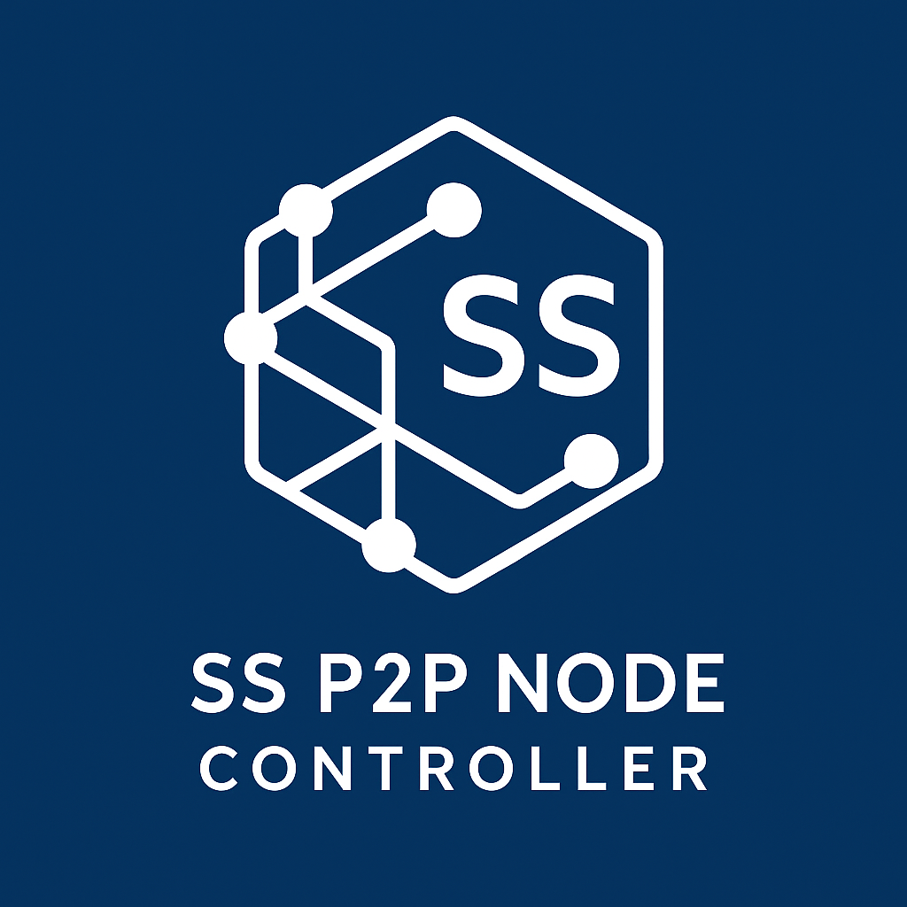

# SS P2P Node Controller



## 概要
SS P2P Node Controllerは, P2Pファイル共有プログラム（[Tinny](https://github.com/y6-maenaka/Tinny)）や独自ブロックチェーンシステム（[miya_core](https://github.com/y6-maenaka/miya_core)）などのネットワークモジュールとして開発された, UDPベースの全自動P2Pオーバーレイネットワーク構築・管理ライブラリです.


<br>

- **P2Pオーバーレイネットワーク構築** : ノード探索からルーティングテーブルの構築・維持・拡大まで自動化
- **Peer間データ転送** : Boost.Asioによる非同期・イベント駆動でのメッセージ送受信
- **DHT** : Churn耐性が高い分散ハッシュテーブル(Kademlia)を採用
- **使いやすいインターフェース** : Socketライクなネットワーク抽象化インターフェースを提供

<br>

すべての通信処理はBoost.Asioの非同期I/Oで実行されており, 複雑なネットワーク管理を開発者の手間なく実現します。
データを送受信に関しては同期的に実行することも可能です.

<br>

## アーキテクチャ詳細

### 1. ICE (Interactive Connectivity Establishment)

#### STUNサーバー機能

- NAT下のPeerに対してグローバルIP:ポート番号を通知

#### TURNサーバー機能

- 双方がNAT越えに失敗した場合, 中継サーバーとしてデータを中継

#### 本プログラムでのTURN実装

本ライブラリでは, すべてのPeerがSTUN/TURN機能を持ちますが, TURNの動作には別の最適化があります. 具体的には：

1. **ダミーパケット送信の指示**
   - 接続先Peer同士がNAT下にいる場合、どちらか一方のPeerにダミーパケット送信を依頼
2. **NAT穴あけ情報の共有**
   - ダミーパケット到達元のアドレス情報を取得し、もう一方のPeerへ通知
3. **P2P直結**
   - データ本体は中継せず、事前にNATに穴をあけることで効率的な通信を確立

<br>

### 2. KademliaベースのPeer管理
Kademliaは, P2Pネットワーク上でキーとバリューのペアを効率的に格納・検索するための分散ハッシュテーブルです.<br>
Kademliaで管理された各Peerは一意なノードID(通常は160bit)を持ち, このID空間全体にデータを分散して配置・検索できます. Peer間の距離はXOR距離によって定義されます.
Kademliaは高Churn耐性(ノードの頻繁な参加・離脱に対して安定性を保つ能力)を有しています.

#### ノードID

- 160ビットの固定長

#### XOR距離メトリック

```cpp
distance(x, y) = x ⊕ y;  // ビット単位の排他的論理和
```

### 3. アーキテクチャ図
<a href="https://gitdiagram.com/y6-maenaka/ss_p2p_node_controller"></a>
<p>powered by <a href="https://gitdiagram.com/">GitDiagram</a></p>


<br><hr><br>

<h2>使い方</h2>
1. Object instantiation and initialization of the node controller <br>
(共通) 1. ノードコントローラーのオブジェクト化と開始

```cpp
ss::node_controlelr n_controller( boost::asio::ip::udp::endpoint self_endpoint, std::shared_ptr<boost::asio::io_context> io_context );
n_controller.start( std::vector<boost::asio::ip::udp::endpoint> boot_eps ); // 既知のノードをブートノードとして幾つか(>0)与える
```

<br><br>

2. Waiting for messages from a specified peer <br>
(単一ピア) 指定ピアからのメッセージ受信待機
```cpp
auto peer = n_controller.get_peer( boost::asio::ip::udp::endpoint peer_udp_endpoint );
auto recved_msg = peer.receive( std::time_t timeout_s ); // 指定無しでメッセージが到着するまでブロッキング
```

<br>

2. Waiting for incoming messages from multiple peers <br>
(多数ピア) ホストに流入してくるメッセージ受信待機
```cpp
auto &message_hub = n_controller.get_message_hub();
message_hub.start( std::function<void(ss::peer::ref, ss::ss_message::ref)> receive_handler );
```

※ ss_message
```cpp
struct ss_message
{
 json body;
 struct
 {
  ip::udp::endpoint src_endpoint;
  std::vector<ip::udp::endpoint> relay_endpoints;
  std::time_t timestamp;
 } meta;
}
```

<br><br>


## 参考

<ul>
<li><a href="https://github.com/arvidn/libtorrent">libtorrent</a> <br></li>
<li>P. Maymounkov and D. Mazières, "Kademlia: A Peer-to-Peer Information System Based on the XOR Metric," in Peer-to-Peer Systems, Lecture Notes in Computer Science, vol. 2429, P. Druschel, F. Kaashoek, and A. Rowstron, Eds. Berlin, Heidelberg: Springer, 2002, pp. 53–65.</li>
</ul>

<br>

## ライセンス
本製品には、OpenSSL Toolkit で使用するために OpenSSL Project で開発されたソフトウェアが含まれています (https://www.openssl.org/)
Copyright (c) 1998-2011 The OpenSSL Project. All rights reserved.


